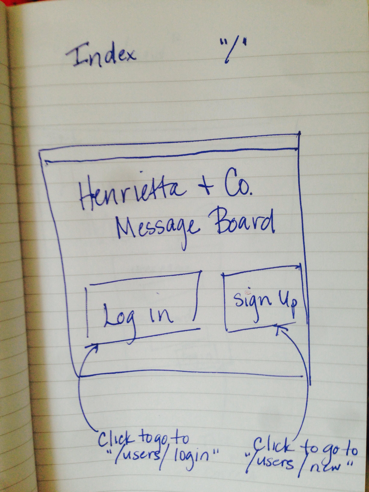
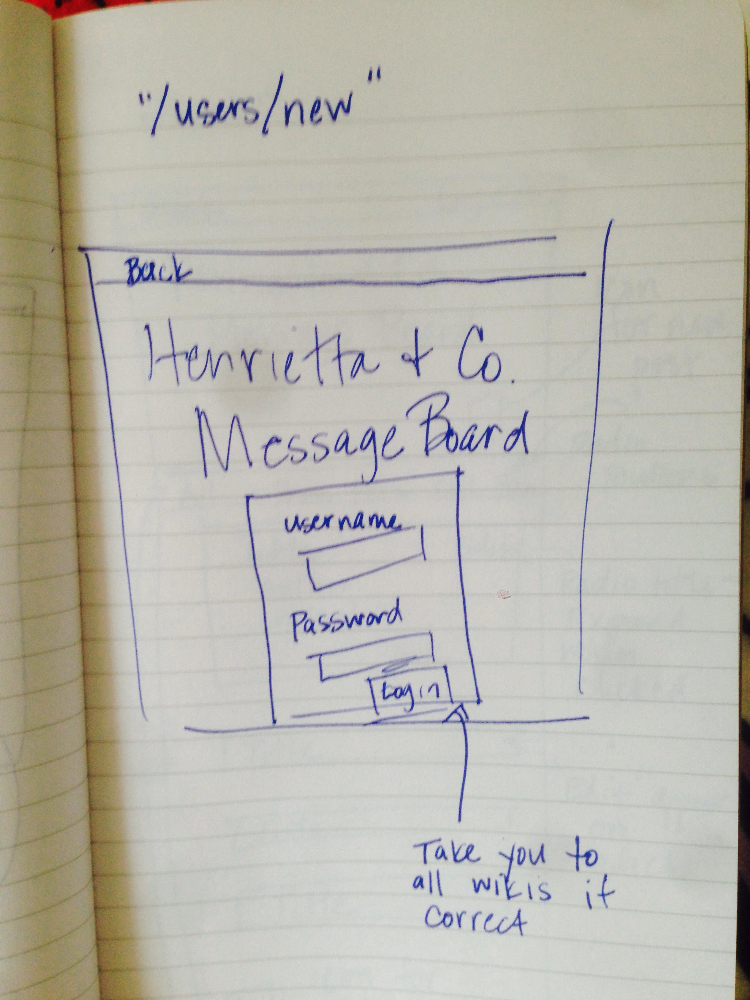
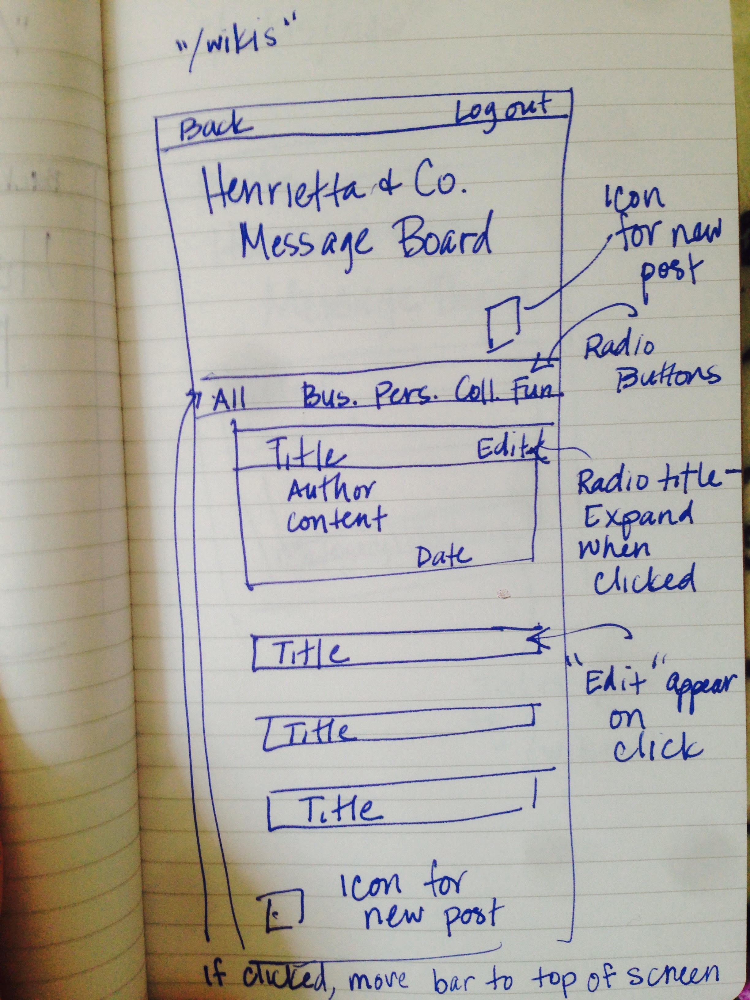
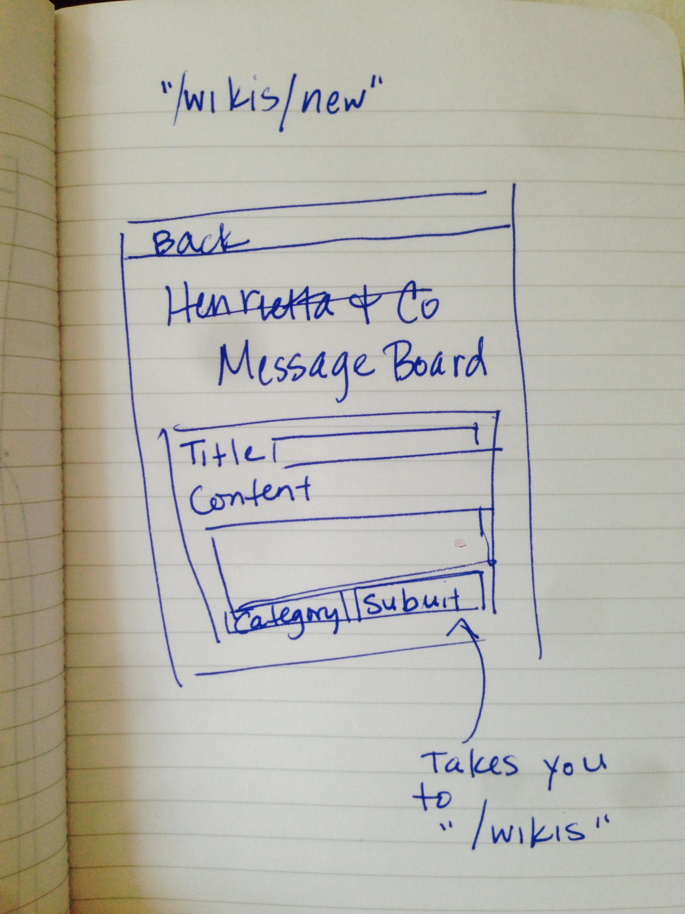
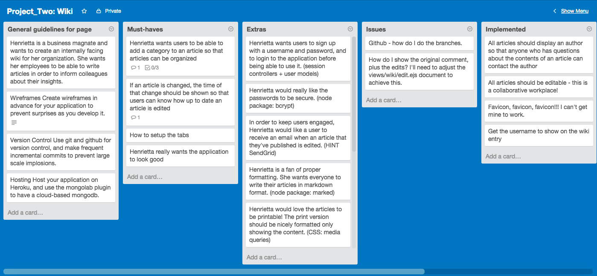

# Project 2 - Wiki

Henrietta & Co. is a MEN stack CRUD application created for my second project will attending General Assembly.

## Overview of App
Henrietta is a business magnate and wants to create an internally facing wiki for her organization. She wants her employees to be able to write articles in order to inform colleagues about their insights.

## Basic Features

- All articles should be editable - this is a collaborative workplace!
- All articles should display an author so that anyone who has questions about the contents of an article can contact the author
- If an article is changed, the time of that change should be shown so that users can know how up to date an article is
- Henrietta wants users to be able to add a category to an article so that articles can be organized
- Henrietta really wants the application to look good

## Advanced Features
Advanced features

- Henrietta wants users to sign up with a username and password, and to login to the application before being able to use it. (session controllers + user models)
- Henrietta would really like the passwords to be secure. (node package: bcrypt)
- Henrietta is a fan of proper formatting. She wants everyone to write their articles in markdown format. (node package: marked)
- Henrietta thinks old changes should persist, rather than be overwritten, so you can see old versions of the article.
- She would like users to be able to comment on changes, so they can discuss the pros and cons of a change.

## Technologies Used
- HTML
- CSS
- JavaScript & jQuery
- node.js & express
- mongoose

## Wireframes:

